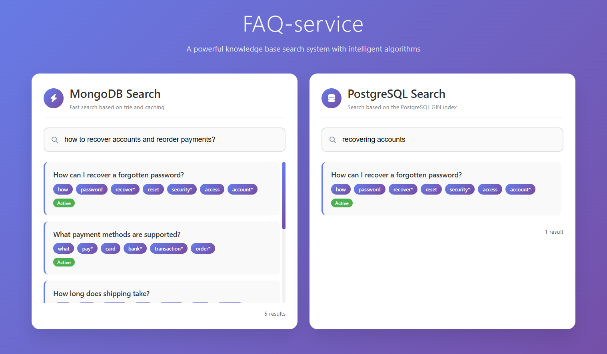
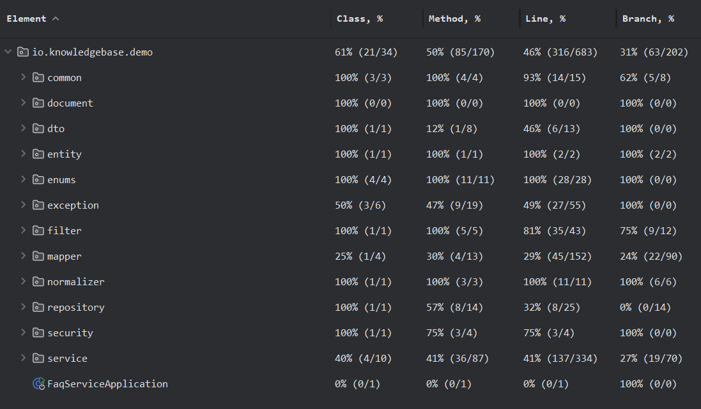

<div align="center">

# FAQ Service

**Enterprise Knowledge Base & Onboarding Platform**


</div>

---

## | Overview

**FAQ Service** is a Spring Boot backend for an internal knowledge base: JWT-secured REST API with role-based access control, PostgreSQL as the system of record, and a scheduled sync job that mirrors FAQ data into MongoDB for a second, independently-built search path — a custom Trie index cached in Redis, run side by side with PostgreSQL's native full-text search so the two approaches can be compared directly.

---

## ⚠️ Disclaimer

This project, **FAQ Service**, is a demonstration artifact and a Minimum Viable Product (MVP).

*   **It is not a commercial product** and is not affiliated with, endorsed by, or a copy of any proprietary system from any existing company.
*   The codebase has been developed as a generic solution to a common business need and **does not contain any proprietary logic, data, or intellectual property** from any specific organization.
*   This project is presented "as-is" for the purposes of evaluation, demonstration, and as a potential starting point for custom development. It may require further hardening, customization, and scaling to meet specific production requirements.

---

## | Features

*   **Authentication & Authorization:** Basic Auth for login/registration, then JWT for all subsequent requests, with role-based access control (Admin/User).
*   **Two search implementations, compared side by side:**
    *   **PostgreSQL GIN Index:** Traditional full-text search using PostgreSQL's powerful GIN indexes.
    *   **MongoDB + Trie + Redis:** A custom-built, ultra-fast prefix-based search algorithm for instant autocomplete and keyword lookup.
*   **Admin API:** Full CRUD operations for managing FAQs and users via REST.
*   **Scheduled sync:** ShedLock-coordinated jobs keep both search backends in sync.
*   **API docs:** OpenAPI 3 spec, auto-generated from annotated controllers via Springdoc, browsable through Swagger UI.
*   **Containerized:** one docker-compose spins up the app plus Postgres, MongoDB, and Redis.

---

## | Tech Stack

| Layer | Technology                                          |
| :--- |:----------------------------------------------------|
| **Framework** | Spring Boot 3.5.5, Spring Security, Spring Data     |
| **Language** | Java 21                                             |
| **Database** | PostgreSQL 17.5 (primary), MongoDB (document store) |
| **Caching** | Redis                                               |
| **Search** | PostgreSQL GIN, MongoDB Custom In-Memory Trie       |
| **Auth** | Basic Auth (login/register) + JWT (jjwt) for authenticated requests |
| **API Docs** | Springdoc OpenAPI 2.8.0 (generates OpenAPI 3 spec) |
| **Task Scheduling** | ShedLock                                            |
| **Database Migration** | Flyway                                              |
| **Mapping** | MapStruct                                           |
| **Logging** | Logback + Logstash encoder                          |
| **Code Quality** | Checkstyle, Lombok                                  |
| **Packaging** | Docker                                              |

---

## | Getting Started

### Prerequisites

*   Java 21
*   Maven 3.6+
*   PostgreSQL 17+
*   MongoDB 7+
*   Redis
*   Docker (optional)

### Installation & Deployment

**Clone the repository:**
```bash
git clone https://github.com/ShilovVyacheslav/faq-service.git
cd faq-service
```

#### Option 1: Local (recommended)

**Manual Setup:**
*   Configure your databases and update the `application-Local.yml` file with your connection credentials.
*   Build and run the application:
   
**Linux / macOS:**
```bash
chmod +x ./mvnw
./mvnw clean package
java -jar target/faq-service-0.0.1-SNAPSHOT.jar --spring.profiles.active=Local
```
**Windows:**
```bash
.\mvnw.cmd clean package
java -jar target/faq-service-0.0.1-SNAPSHOT.jar --spring.profiles.active=Local
```

#### Option 2: Docker

Requires only Docker and Docker Compose.
```bash
docker-compose up --build
```

This builds the app inside a container and starts Postgres, MongoDB, and Redis alongside it. The app is available at `http://localhost:8080` once all health checks pass.

### Default Admin Account

On first startup, a Flyway migration seeds one admin user. You need it to log in and create any other users or FAQs:

- **Username:** `admin`
- **Password:** `@Password0`

---

## | Exploring the API

### 1. API Documentation
**Swagger UI: [http://localhost:8080/swagger-ui/index.html](http://localhost:8080/swagger-ui/index.html)**

Authenticate, retrieve a JWT token, and test all endpoints for FAQ and user management in Postman.

### 2. Search Demo
**[http://localhost:8080/search.html](http://localhost:8080/search.html)**

Enter keywords and observe the response times and results from PostgreSQL and MongoDB with the Trie index and cached responses.



### 3. Test Coverage
Unit tests cover core business logic, services, and utilities.



---

## Why This Project?

Every company, regardless of size, struggles with knowledge silos and inefficient onboarding. This service provides a ready-to-deploy, technologically advanced solution to this universal problem. It's not just a FAQ system; it's a productivity multiplier engineered for the modern enterprise.

---

## License

MIT